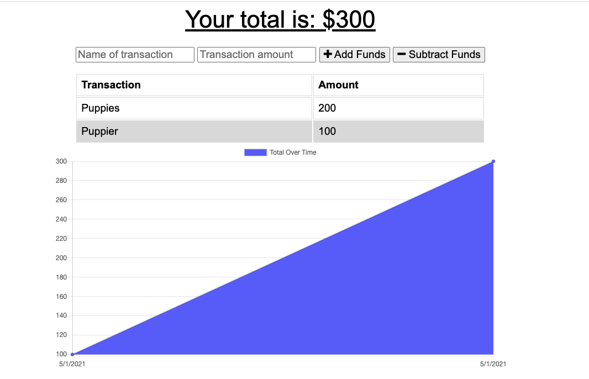

# Online/Offline Budget Trackers

This budget tracker app is a refactor of a previously provided application. The app now allow for offline access and functionality as a PWA app via a service worker and contains a manifest.webmanifest file.

Offline Functionality:

  * Enter deposits offline

  * Enter expenses offline

When brought back online:

  * Offline entries should be added to tracker.

## Installation
This budget app uses these technologies: service-worker, indexedDB, manifest.webmanifest, Mongoose and Express.

Here is the live deployed app on Heroku.

To run locally:
```npm i```
```npm start```
All packages are providedin the package.json file

## Usage

Deposits can be entered in the below page Offline or Online:



## License

License
The MIT License (MIT) © 2021 Morgan Bailey

© 2021 Trilogy Education Services, LLC, a 2U, Inc. brand. Confidential and Proprietary. All Rights Reserved.